### Bouwstappen

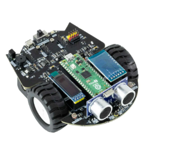

## Wat hebben we nodig

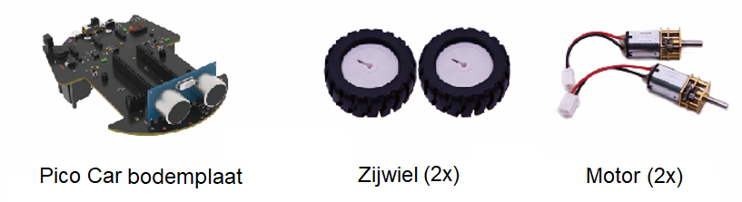

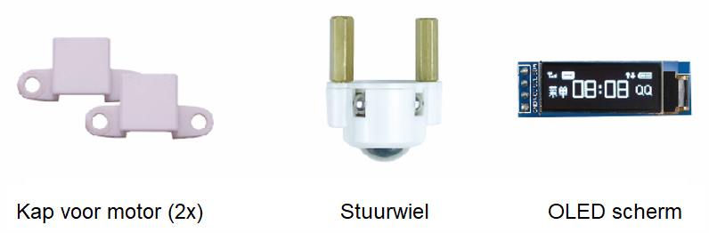

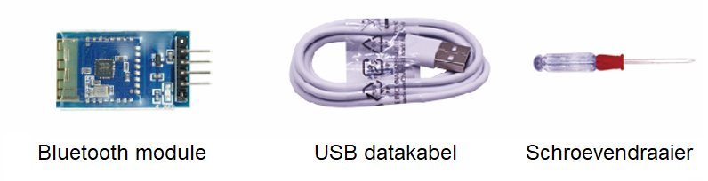

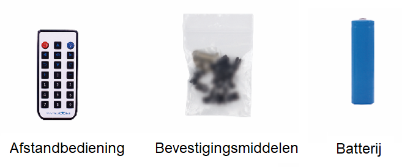

## 1. Monteer de motoren
:::{note}
Bij het installeren van de motor moet de tandwielloze zijde met de smalle sleuf worden uitgelijnd met de tinnen strip op de bodemplaat (zoals hieronder weergegeven).
:::

::::{grid} 2
:::{grid-item-card} 
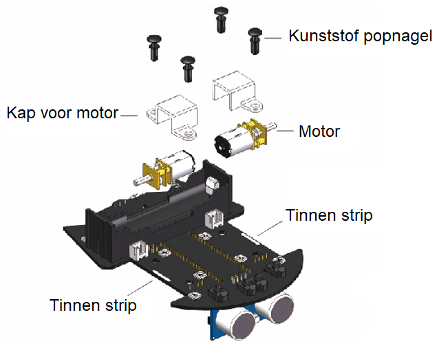
:::
:::{grid-item-card}
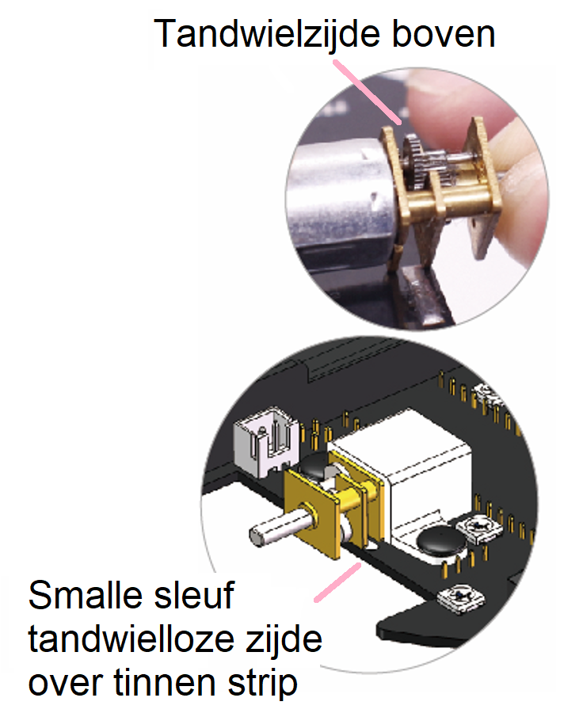
:::
::::

## 2. Monteer het stuurwiel
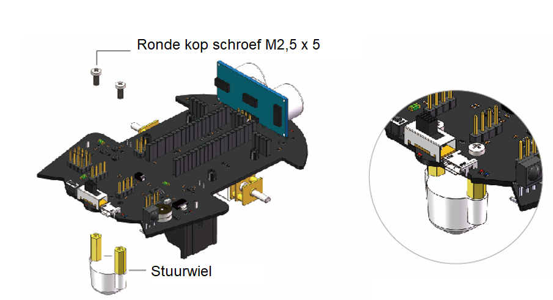

## 3. Monteer de zijwielen
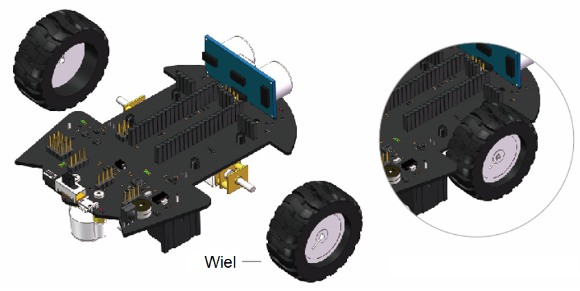

## 4. Monteer het OLED scherm en de Bluetooth module
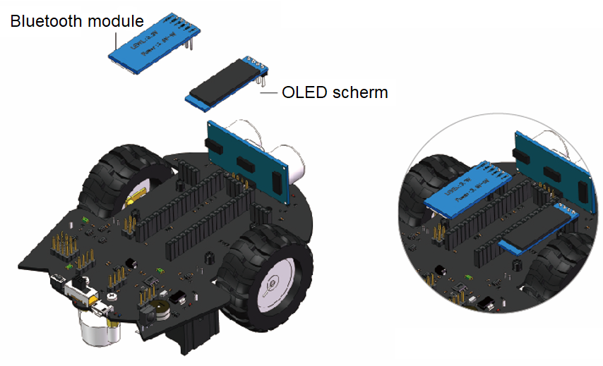

## 5. Monteer de “Raspberry Pi” (de computer)
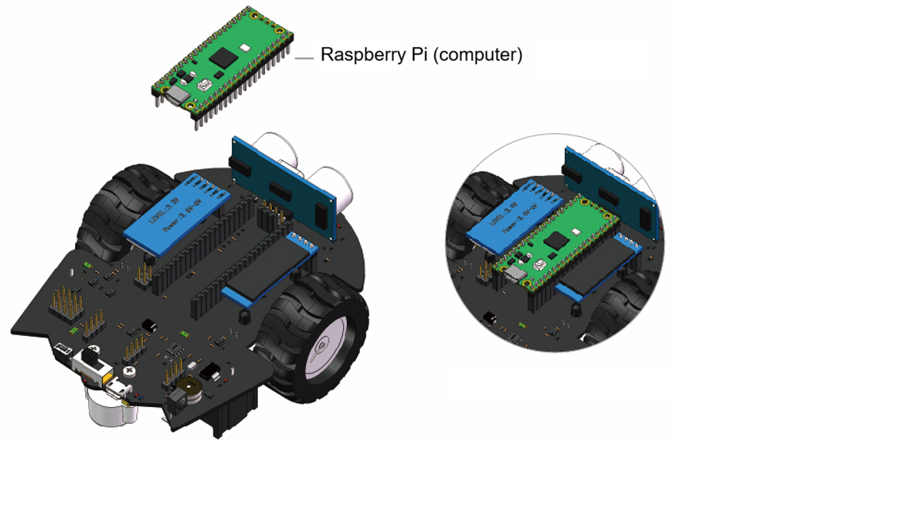

## 6. Monteer de batterij
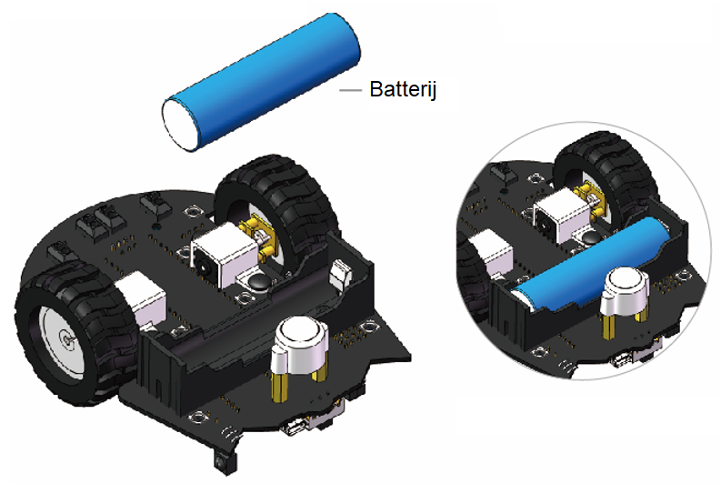

## 7. Aansluitdiagram
Elk component dient volgens de onderstaande afbeeldingen correct te zijn aangesloten.
::::{grid} 2
:::{grid-item-card} 
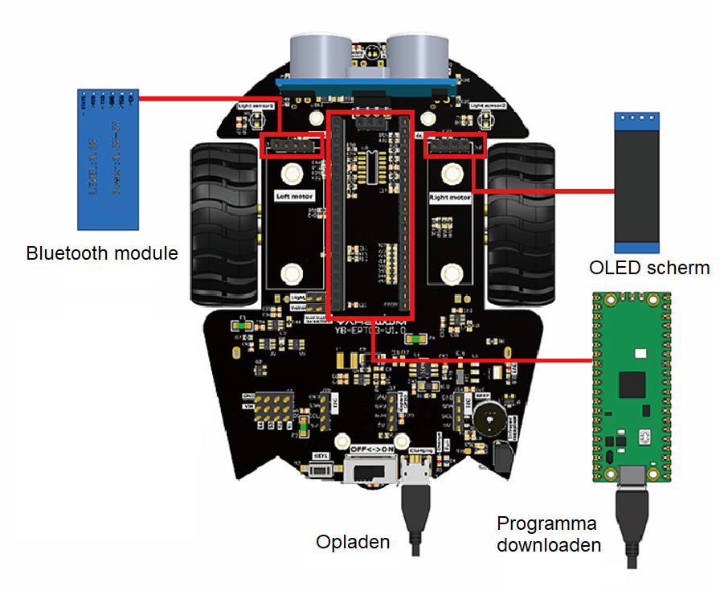
:::
:::{grid-item-card}
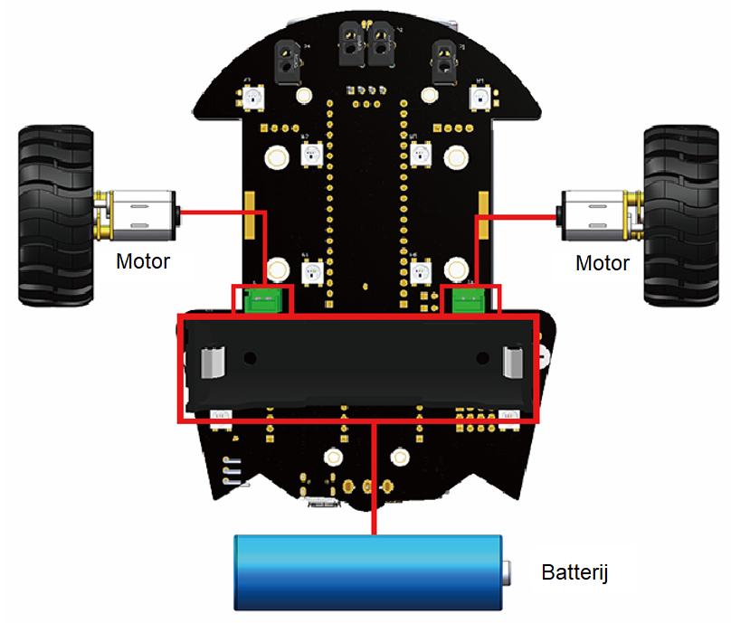
:::
::::

**🎉 Gefeliciteerd!** Je robot is nu in elkaar gezet!

