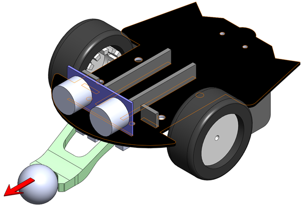
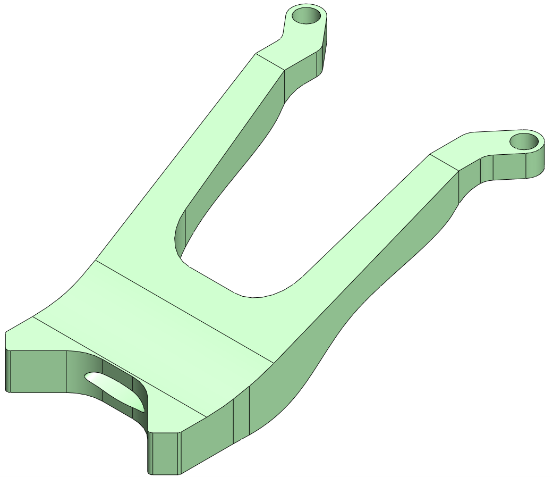
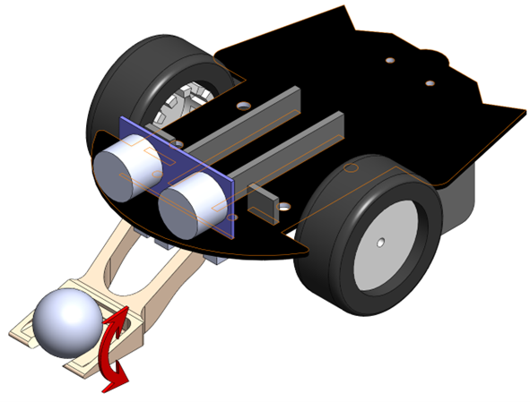
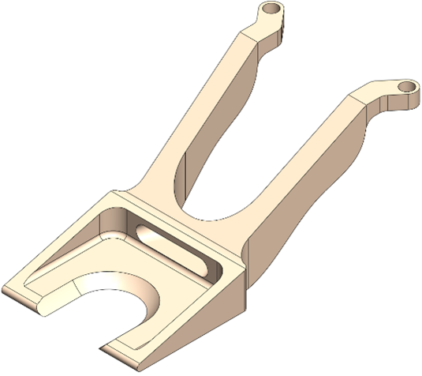
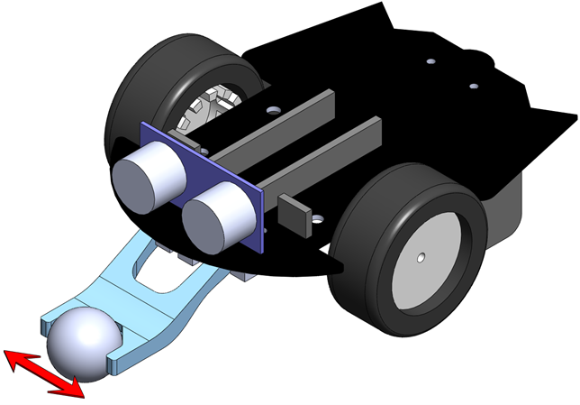
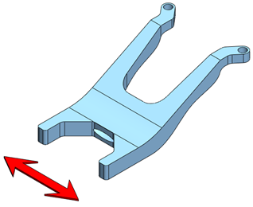

# Les 5: Maak je eigen robot-werktuig

In deze les ga je aan de slag met het ontwerpen en bouwen van je eigen robot-werktuig. Je leert hoe je verschillende componenten kunt combineren om een functioneel werktuig te creëren dat specifieke taken kan uitvoeren. We zullen ook bespreken hoe je je werktuig kunt integreren met de bestaande robot en hoe je het kunt programmeren om samen te werken met de robot's besturingssysteem.

## Afbeeldingen van werktuigen
Text Paul moet nog worden toegevoegd

## Parts downloads

[Bodemplaat-1.SLDPRT](https://raw.githubusercontent.com/AvansMechatronica/vabokCursusRoboticaMetPython/main/solidworks/Bodemplaat-1.SLDPRT)

[Wiel.SLDPRT](https://raw.githubusercontent.com/AvansMechatronica/vabokCursusRoboticaMetPython/main/solidworks/Wiel.SLDPRT)

## Assembly downloads

[Pico-Robot-Y.SLDASM](https://raw.githubusercontent.com/AvansMechatronica/vabokCursusRoboticaMetPython/main/Pico-Robot-Y.SLDASM)