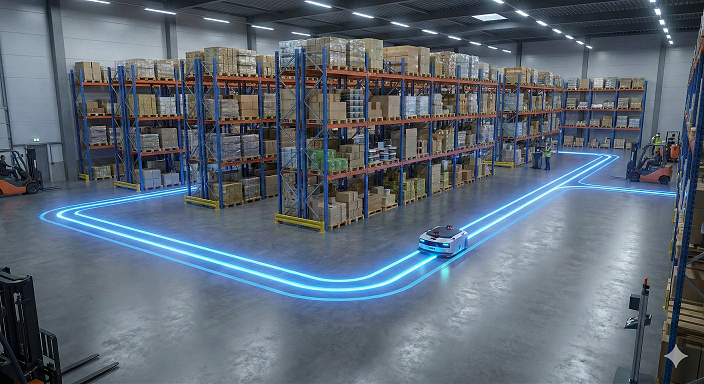
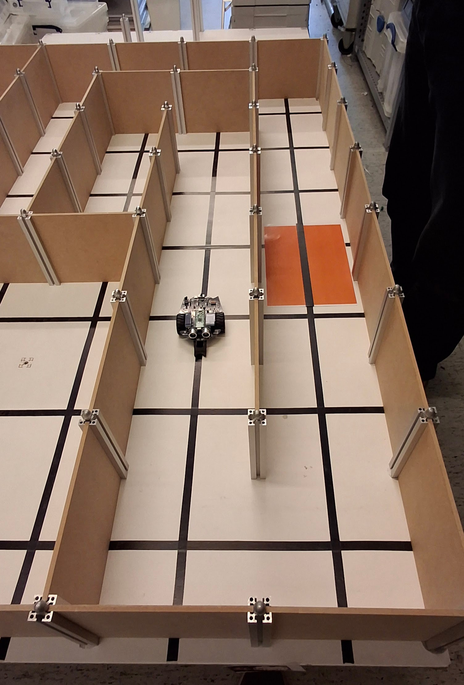
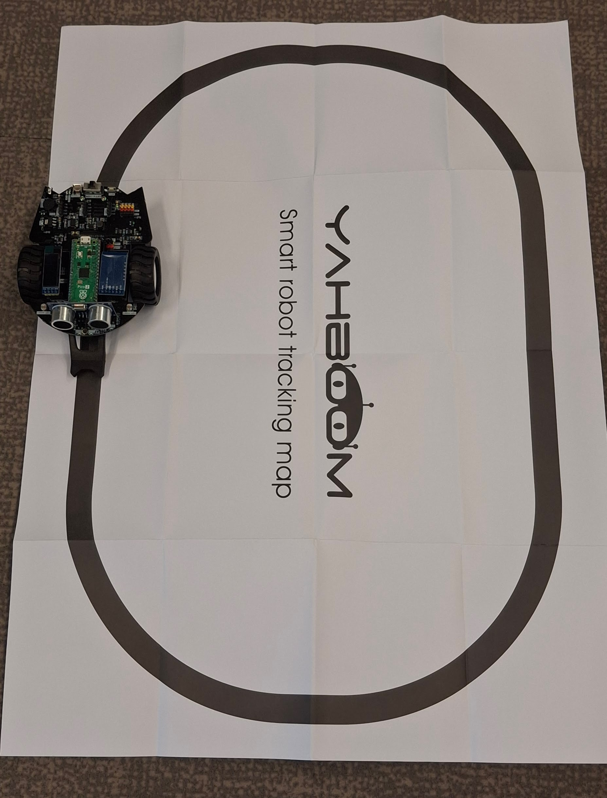

# Les 7: Introductie van de examenopdracht

In deze les maken we kennis met de examenopdracht van de cursus. We bespreken de vereisten en doelstellingen van de opdracht, evenals de beoordelingscriteria. Je krijgt ook de kans om vragen te stellen en eventuele onduidelijkheden te bespreken voordat je aan de slag gaat met het ontwerpen en bouwen van je eigen robotproject.

## Doelstellingen van de examenopdracht
- Toepassen van de kennis en vaardigheden die je hebt opgedaan tijdens de cursus.
- Ontwerpen en bouwen van een functioneel robotproject dat een specifieke taak uitvoert.
- Documenteren van het ontwerpproces en de implementatie van je project.

## De examenopdracht

Je werkt als junior-robotengineer aan een project voor een internetwinkel dat een groot magazijn heeft met veel verschillende producten. De producten zijn netjes opgeslagen in magazijnstellingen en worden regelmatig bijgevuld. De winkel heeft een robot nodig die de producten kan ophalen en naar de verpakkingsafdeling kan brengen.

### Vereisten
- De robot moet in staat zijn om producten op te halen uit de magazijnstellingen.
- De robot moet de producten naar de verpakkingsafdeling kunnen brengen.
- De robot moet veilig kunnen navigeren door het magazijn zonder schade aan te richten.

### Magzijnindeling
er zijn twee soorten magazijnopstellingen:
1. Het magazijn wordt voorgesteld als een grid van 5 rijen en 5 kolommen, waarbij elke cel een magazijnstelling vertegenwoordigt. De robot navigeert van de ene cel naar de andere om producten op te halen en te vervoeren.
2. Het magazijn wordt voorgesteld als een lijn waarlangs de magazijnstellingen zijn geplaatst. De robot moet van de ene kant van de lijn naar de andere kunnen navigeren.

::::{grid}
:::{grid-item-card}

Voorbeeld van robot in een doolhof-achtige omgeving, vergelijkbaar met de grid-opstelling van het magazijn.
:::
:::{grid-item-card}

Voorbeeld van robot die een lijn volgt, vergelijkbaar met de lijn-opstelling van het magazijn.
:::
::::

## Stappenplan
1. **Ontwerp**: Bedenk een ontwerp voor je robot dat voldoet aan de vereisten van de opdracht. Denk na over de sensoren, actuatoren en het navigatiesysteem dat je wilt gebruiken.
2. **Bouw**: Gebruik de materialen en tools die je tot je beschikking hebt om je robot te bouwen volgens je ontwerp.
3. **Programmeer**: Schrijf de code die nodig is om je robot te laten functioneren en de taken uit te voeren die in de opdracht zijn beschreven.
4. **Test**: Test je robot in een gesimuleerde omgeving om ervoor te zorgen dat het correct functioneert en de taken uitvoert zoals bedoeld.

## Werkwijze

- Je werkt in tweetallen aan deze opdracht, waarbij je samen het ontwerp, de bouw en de programmering van de robot aanpakt. Je werkt samen aan één van de twee magazijnopstellingen. De docent zal de teams indelen en de magazijnopstellingen toewijzen.
- Je hebt toegang tot de materialen en tools die je nodig hebt om je robot te bouwen, evenals tot de online bronnen en documentatie die je kunnen helpen bij het ontwerpen en programmeren van je robot.
- Je zult regelmatig feedback krijgen van de instructeurs en medestudenten om je te helpen bij het verbeteren van je ontwerp en implementatie.

## Beoordelingscriteria
- **Samenwerking**: Je moet effectief samenwerken met je teamgenoot en bijdragen aan alle aspecten van het project.
- **Functionaliteit**: De robot moet de taken uitvoeren zoals beschreven in de opdracht.
- **Ontwerp**: Het ontwerp van de robot moet creatief en effectief zijn in het oplossen van het probleem.
- **Programmering**: De code moet goed gestructureerd, leesbaar en efficiënt zijn.
- **Documentatie**: Je moet een duidelijke en gedetailleerde documentatie van je ontwerpproces en implementatie leveren, inclusief eventuele uitdagingen en hoe je deze hebt opgelost.
