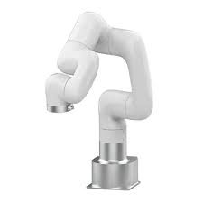

# Gebruikte robots

In deze cursus maken we gebruik van de volgende robots:

1. **Pico Robot**: Een kleine, programmeerbare robot die eenvoudig te gebruiken is voor beginners.

[Info Pico Robot](https://www.yahboom.net/study/Pico_Robot)

2. **uFactory Lite 6**: Een robotarm die geschikt is voor het uitvoeren van eenvoudige taken en het leren van robotbesturing.

[Info uFactory Robot](https://www.ufactory.us/product/lite-6)

Elke robot heeft zijn eigen specifieke kenmerken en mogelijkheden, en we zullen leren hoe we ze kunnen programmeren en besturen met behulp van Python. Zorg ervoor dat je toegang hebt tot deze robots tijdens de cursus, zodat je de praktische oefeningen kunt volgen.